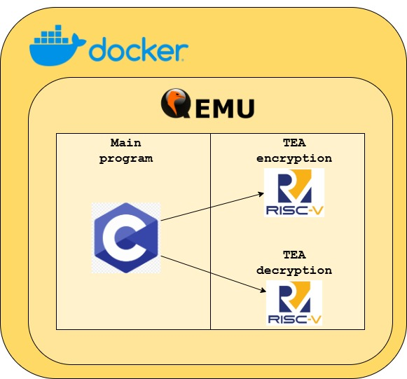

# Proyecto I: Encriptación y decriptación con TEA en un entorno QEMU
## Arquitectura de Computadores I
### Profesor: Dr. Ing. Jeferson Gonzalez
### Estudiante: Eduardo Bolívar Minguet 2020158103

Este proyecto presenta un ambiente de desarrollo de Qemu dentro de un contenedor Docker que provee el toolchain necesario para la compilación. El proyecto está dividido en tres programas: encriptación, decriptación, y manejo de cadenas de caractéres. A continuación se presentan los detalles de arquitectura y funcionalidad. 

---

## 1. Arquitectura del Software

### Programa en C

El programa principal se encuentra escrito en el lenguaje de programación C e implementa funciones para el manejo de caracteres y llamado de las funciones de encriptación y decriptación. Las funciones de encriptación y decriptación son declaradas como externas, es decir, el compilador no relaciona la definición de estas funciones dentro del código fuente, sino que deben ser buscadas por el enlazador.

### Ensamblador RV32

En lenguaje ensamblador RV32 se encuentran definidas las funciones de encriptación y decriptación propiamente. En un archivo (tea_encrypt.s) se encuentra el código fuente para la encriptación de una cadena de carácteres dada una dirección de memoria; en otro archivo (tea_decrypt.s) se encuentra el código fuente para la decriptación. Estas funciones son invocadas por el programa de C, y enlazadas de forma externa. 

### Entorno de compilación

Se trata de un entorno QEMU para la simulación de ejecución sin sistema operativo (bare-metal). El toolchain para generar el binario se encuentra contenido en Docker, lo que facilita la compilación sin necesidad de instalar todas las herramientas.

### Decisiones de diseño

Al tratarse de una programación bare-metal, se decidió establecer de forma fija un arreglo de cadenas de carácteres en memoria, así como una clave de encriptación también fija en memoria. El programador debe recompilar para elegir otra cadena de caracteres y/u otra clave. 



---

## 2. Funcionalidades implementadas

### a. Encriptación TEA

Para la encriptación, las direcciones de memoria de las cadenas de texto y la clave fueron pasadas por argumentos a los registros a0 y a1. En el primer bloque del programa se cargan los inmediatos necesarios en registros, como la constante DELTA (0x9e3779b9), número de rondas (32), el acumulador de suma (inicialmente 0), y los valores de las palabras a encriptar.

En el segundo bloque, el algoritmo ingresa al ciclo para inmediatamente cargar los valores de la clave, y además, donde se suma la constante DELTA con el acumulador, se realizan corrimientos a la izquierda, a la derecha, sumas, y operaciones xor por treinta y dos interaciones, esto se realiza restando uno al registro con el número de rondas y comparando con cero.

Al terminar los ciclos de operaciones, se inicia el tercer bloque, donde se guarda el valor encriptado en la dirección de memoria original de ambas palabras.

### b. Decriptación TEA

Para la decriptación, el proceso es muy similar a la encriptación, sin embargo, con el orden de operaciones invertido. Las dirección de las palabras a encriptar son pasadas al registro a0 y la de la clave a a1. Al iniciar el primer bloque, la única asignación diferente es al acumulador de suma, el cual recibe el resultado de DELTA multiplicado por el número de rondas.

En el segundo bloque, donde ocurren las iteraciones, la mayoría son las mismas operaciones que en el algoritmo de encriptación; únicamente difiere en que se le resta la constante DELTA al acumulador.

Al finalizar, el último bloque consiste en guardar la palabra decriptada en la dirección original.

### c. Transformación de cadena de texto a palabras hexadecimales

Esta es una funcionalidad en la capa de C. La cadena de texto que contiene el mensaje para encriptar sirve como insumo, de forma que se calcula el largo de la cadena, se calcula el número de palabras de 32 bits necesarias para dicho mensaje, luego se realizan n iteraciones, donde n es el número de palabras calculadas. 

Dentro del loop, se asignan los cuatro bytes que conforman la palabra, si el rango está dentro del largo de la cadena, se asigna el valor hexadecimal del carácter, sino, se le asigna 0x00 (logrando padding de 0). Al tener los cuatro bytes, estos son asignados a la dirección de memoria correspondiente del arreglo de palabras resultante.

### d. Imprimir cadenas de texto y palabras hexadecimales

La impresión se realiza de forma volatil debido al ambiente bare-metal. Cada carácter es asignado a una dirección de memoria 0x10000000 para mostrarse en consola. Las funciones de impresión recorren la cadena de carácteres o el arreglo de palabras (según sea el caso) y llaman a la función volatil para cada carácter.

---

## 3. Resultados


---

## 4. Instrucciones de uso de la aplicación

- Se debe tener acceso a dos terminales en paralelo: una se encarga de ejecutar el contenedor con el ambiente QEMU, y la segunda se encarga de conectarse a la primera por medio de target remote de GDB.
- En la Terminal 1, ejecutar
```
./run.sh
```
  para construir el contenedor de Docker (si aún no está construido) y lanzar el ambiente QEMU.
- En la Terminal 2, ejecutar
```
docker exec -it rvqemu /bin/bash
```
  para ingresar al ambiente QEMU
- Ya dentro de QEMU en ambas terminales, en la Terminal 1 debe compilar y ejecutar el programa
```
./build.sh
./run-qemu.sh
```
- En la Terminal 2, ejecutar
```
gdb-multiarch main.elf
```
  para inicar GDB ligado al ejecutable main.elf.
- En la Terminal 2, dentro de GDB, ejecutar
```
target remote :1234
```
  para conectar de forma remota el GDB con el programa QEMU.
- Finalmente, ya con la conexión remota, ejecutar
```
continue
```
- Esto ejecutará completamente el programa y podrá visualizar la impresión de todas los mensajes de prueba, con su respectiva encriptación y decriptación, en la Terminal 1.

